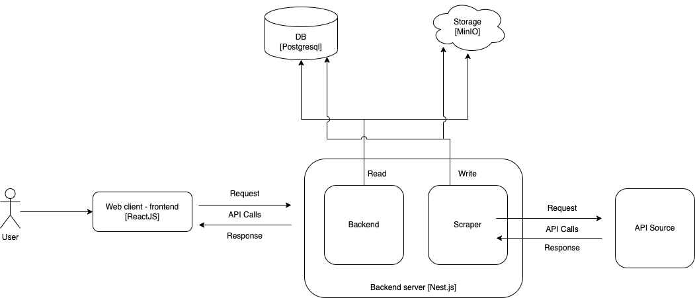
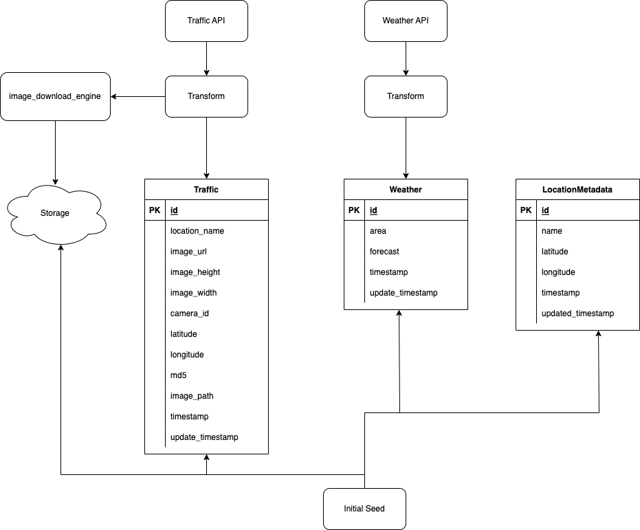

# Introduction

This app was created based on [weather](https://beta.data.gov.sg/datasets/1456/resources/d_91ffc58263cff535910c16a4166ccbc3/view) and [traffic](https://beta.data.gov.sg/datasets/354/view) APIs from data.gov.sg. It has been tested on an Intel-based Macbook Pro.

## App components

The app has been dockerized as containers. There will be 4 containers required to run the app.

- Database (DB)): Postgresql
- Storage: MinIO
- Backend + Scraper: NestJS
- Frontend: ReactJS

The scraper module will be pulling the 2 APIs above and saving the data into the DB and traffic images to MinIO storage. Currently, the job is set to every 2 minutes. You may change this frequency at these 2 files:

- backend/src/scraper/scraper-traffic/traffic.controller.ts
- backend/src/scraper/scraper-weather/weather.controller.ts

```backend/src/scraper/scraper-traffic/traffic.controller.ts
// backend/src/scraper/scraper-traffic/traffic.controller.ts
...
...
@Cron('0 */2 * * * *') <= this line
@Post('download')
  async fetchAndSaveData() {
...
...

// backend/src/scraper/scraper-weather/weather.controller.ts
...
...
@Cron('0 */2 * * * *') <= this line
  @Post('download')
  async fetchAndSaveData() {
...
```

Please refer to this [link](https://docs.nestjs.com/techniques/task-scheduling) for more information about the cron job.

If you do not want to run the cron job for subsequent runs of the app, you can also comment out the 2 lines above.

# Setup

## Prerequisite + installation

Before starting with setup, please ensure you have [docker](https://www.docker.com/) and [docker-compose](https://docs.docker.com/compose/install/) installed in your machine.

## Edit .env file

Environment variables for the docker containers are stored in the .env file. A sample .env file has been included in the repo. This file is called `.env-sample`. Please copy the file and rename it to `.env`.

Once done, you can amend the environment variables in the file. Credentials for database and storage has been removed from the file. You need to add them before starting the containers.

NOTE: Please ensure these values are filled up before starting the containers.

- POSTGRES_USER
- POSTGRES_PASSWORD
- AWS_ACCESS_KEY_ID
- AWS_SECRET_ACCESS_KEY

Details of the environment variables are provided below.

> POSTGRES_NAME: Container name for database. Default value: app_db
>
> POSTGRES_USER: Username login credentials for database. Please fill this up.
>
> POSTGRES_PASSWORD: Password login for credentials database. Plase fill this up
>
> POSTGRES_DB: Database to be used. Default value: nest
>
> POSTGRES_PORT: Database container port to be used. Default value: 5432
>
> MINIO_SERVER_NAME: Container name for storage server. Default value: minio-server
>
> MINIO_CLIENT_NAME: Container name for storage client. Default value: minio-client
>
> APP_BUCKET_NAME: Storage bucket name for app. Default value: traffic-images
>
> APP_IMAGE_FOLDER: Folder name in storage bucket. Default value: images
>
> MINIO_PORT: Storage container port to be used. Default value: 9000
>
> AWS_ACCESS_KEY_ID: Username login credentials for storage container. Please fill this up.
>
> AWS_SECRET_ACCESS_KEY: Password login credentials for storage container. Please fill this up.
>
> BACKEND_PORT: Backend container port to be used. Default value: 3344
>
> BACKEND_NAME: Container name for backend. Default value: backend
>
> BACKEND_FOLDER: Working directory name for backend container. Default value: backend
>
> FRONTEND_PORT: Frontend container port to be used. Default value: 3000
>
> FRONTEND_FOLDER: Working direcetory name for frontend container. Default value: frontend
>
> FRONTEND_NAME: Container name for frontend. Default value: frontend

## Start docker containers

Once you have setup the `.env` file, you can start the app. Run the following command in the root folder of this repo. Depending on your docker compose version, you might execute a different command. You may want to exclude the `-d` command if you prefer to see the setup logs

For the `first run / initial setup`, please run this command in the root folder:

`sh initial-run.sh `

`sh initial-run.sh`

For other runs, please execute either one of the following codes based on your docker compose version in the root folder.

V1:

`docker-compose up -d`

V2

`docker compose up -d`

The container may take some time to setup. The initial setup may take longer as it is doing some initial setup and seeding some sample / dummy data to the database before the actual data scraping.

**Note: Root folder - this repo's home/ main folder**

# Overall architecture + data flow

This is the overall architecture of the different components and data flow from API source to the DB and storage.

The backend has these services/components - `weather`, `traffic`, `datetime`, `location` and `scraper`.

The frontend has these services/components - `weather`, `traffic`, `datetime` and `location`.

###### Overall architecture



###### Data flow



# Assumptions

The App was created based on the architecture below with the following assumptions:

- Docker is used as it is easier to setup DB and manage environments using docker containers and purging data
- Reverse geocoding for traffic latitude and longitude is done based on `scraper/traffic` service component of the backend based on Weather API locations. I have tried a few geocoding APIs such as `OneMap` and `BigDataCloud`, but the API response were either null or have mismatch names when comparing with the Weather API (Bedok vs Bedok New Town). There is also a limit on the number of API calls with the free account
- The API provider does not allow fetching of data after a certain date - i.e. Today is 01 Sep 2023, but data on 01 Jun 2023 is not available
- Initially I wanted to separate the scraper and backend components. However, as I was using PrismaClient to manage the DB services, I would need to maintain duplicate copies of `schema.prisma` files. This would mean manually copying over the file if one of the components gets updated. Hence, for this version of the App, I have combined the 2 components into 1 docker container
- Weather images are based on what I have seen from the API and NEA website. There might be relevant weather conditions that may have not been covered and this returns an empty image placeholder

# Future Works

- The calendar component needs some rework as it may automatically close the window and allow users to select unavailable time. The current work around it to return an empty image placeholder
- The location select menu can be quite long. A scroll select menu feature might improve the user's experience
- A nicer/better selection of weather images based on different forecast values
